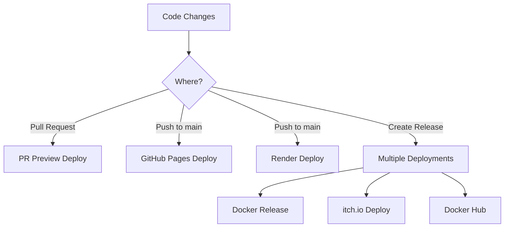

# Deployment Guide

This project supports multiple deployment methods for different use cases. All deployments are automated through GitHub Actions.

## 🚀 Deployment Options

### 1. GitHub Pages (Singleplayer)
- **URL**: https://commjoen.github.io/generated-game-experiment/
- **Trigger**: Automatic on every push to `main`
- **Use Case**: Static hosting, singleplayer mode
- **Workflow**: `.github/workflows/deploy.yml`

### 2. Render.com (Multiplayer)
- **URL**: https://generated-game-experiment.onrender.com/
- **Trigger**: Automatic on pushes via render.yaml
- **Use Case**: Full multiplayer support with WebSocket server
- **Config**: `render.yaml`

### 3. itch.io (Game Distribution)
- **URL**: https://commjoen.itch.io/generated-game-experiment
- **Trigger**: Automatic on releases
- **Use Case**: Game distribution platform
- **Workflow**: `.github/workflows/itch-io-deploy.yml`
- **Setup**: See [ITCH_IO_SETUP.md](ITCH_IO_SETUP.md)

### 4. Docker (Self-hosted)
- **Registry**: ghcr.io/commjoen/generated-game-experiment
- **Trigger**: Automatic on releases and PRs
- **Use Case**: Self-hosted deployment with full control
- **Workflow**: `.github/workflows/docker-release.yml`

### 5. PR Previews
- **URL Pattern**: https://commjoen.github.io/generated-game-experiment/pr-{number}/
- **Trigger**: Automatic on pull requests
- **Use Case**: Testing changes before merge
- **Workflow**: `.github/workflows/pr-preview.yml`

## 🔄 Deployment Flow



## ⚙️ Setup Requirements

### GitHub Pages
- No setup required - works out of the box

### Render.com
- Connect GitHub repository to Render
- `render.yaml` configuration included

### itch.io
- `BUTLER_API_KEY` secret required
- Optional: `ITCH_USER`, `ITCH_GAME` secrets
- Game page must exist on itch.io

### Docker
- GitHub Container Registry - works automatically
- Docker Hub - requires `DOCKER_HUB_USERNAME` and `DOCKER_HUB_TOKEN` secrets

## 🏷️ Version Management

All deployments use semantic versioning:
- Tags: `v1.0.0`, `v1.0.1`, etc.
- Docker images get multiple tags: `v1.0.0`, `1.0`, `1`, `latest`
- itch.io uses the tag version as the user version

## 🔧 Manual Deployment

### Create a Release
```bash
# Trigger all deployment methods
gh workflow run release.yml -f version_type=patch
```

### Deploy to itch.io manually
```bash
# Deploy specific version
gh workflow run itch-io-deploy.yml -f tag=v1.0.0
```

### Deploy Docker manually
```bash
# Trigger Docker build
gh workflow run docker-release.yml
```

## 🛠️ Troubleshooting

### Common Issues

1. **GitHub Pages not updating**
   - Check Actions tab for build failures
   - Verify `dist/` directory is being generated

2. **Render deployment failing**
   - Check Render dashboard for logs
   - Verify `render.yaml` configuration

3. **itch.io deployment failing**
   - Check `BUTLER_API_KEY` secret
   - Verify game page exists on itch.io
   - See detailed troubleshooting in [ITCH_IO_SETUP.md](ITCH_IO_SETUP.md)

4. **Docker build failing**
   - Check for dependency issues
   - Verify Dockerfile syntax
   - Check Actions logs for detailed errors

### Logs and Monitoring

- **GitHub Actions**: Repository → Actions tab
- **Render**: Render dashboard → Logs
- **itch.io**: GitHub Actions logs for deployment status
- **Docker**: GitHub Container Registry for image details

## 📊 Deployment Matrix

| Platform | Mode | Server | Build Time | Auto Deploy | Manual Deploy |
|----------|------|--------|------------|-------------|---------------|
| GitHub Pages | Single | Static | ~2 min | ✅ Push | ❌ |
| Render | Multi | Express | ~5 min | ✅ Push | ✅ |
| itch.io | Single | Static | ~3 min | ✅ Release | ✅ |
| Docker | Multi | Express | ~8 min | ✅ Release | ✅ |
| PR Preview | Single | Static | ~2 min | ✅ PR | ❌ |

## 🔒 Security

- All secrets are stored securely in GitHub repository settings
- Docker images are scanned with Trivy for vulnerabilities
- No credentials are logged or exposed in workflows
- itch.io API keys have limited scope for deployment only